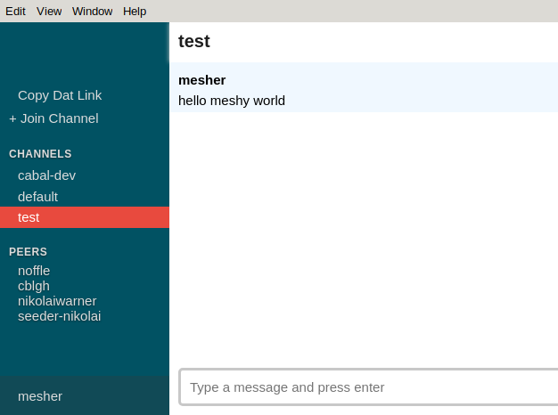

# Cabal Desktop

> Desktop client for cabal, the p2p/decentralized/offline-first chat platform.

<center></center>

## Install

### Download the latest release

https://github.com/cabal-club/cabal-desktop/releases/

### Build from source

```
$ git clone https://github.com/cabal-club/cabal-desktop
$ cd cabal-desktop

$ npm install             # install dependencies
$ npm start               # start the application
```

### Download from AUR
https://aur.archlinux.org/packages/cabal-desktop-git/

## Distribute

build for current platform:

```
$ npm run dist
```

build for [multiple platforms](https://www.electron.build/multi-platform-build#docker):

```
$ ./bin/build-multi
```

## How to Contribute

### Formatting Rules

This repository is formatted with [StandardJS](https://standardjs.com/) (there is a [vscode](https://marketplace.visualstudio.com/items?itemName=chenxsan.vscode-standardjs) plugin).

## Contributors

### Code Contributors

This project exists thanks to all the people who contribute. [[Contribute](CONTRIBUTING.md)].
<a href="https://github.com/cabal-club/cabal-desktop/graphs/contributors"></a>

### Financial Contributors

Become a financial contributor and help us sustain our community. [[Contribute](https://opencollective.com/cabal-club/contribute)]

#### Individuals

<a href="https://opencollective.com/cabal-club"></a>

#### Organizations

Support this project with your organization. Your logo will show up here with a link to your website. [[Contribute](https://opencollective.com/cabal-club/contribute)]

<a href="https://opencollective.com/cabal-club/organization/0/website"></a>
<a href="https://opencollective.com/cabal-club/organization/1/website"></a>
<a href="https://opencollective.com/cabal-club/organization/2/website"></a>
<a href="https://opencollective.com/cabal-club/organization/3/website"></a>
<a href="https://opencollective.com/cabal-club/organization/4/website"></a>
<a href="https://opencollective.com/cabal-club/organization/5/website"></a>
<a href="https://opencollective.com/cabal-club/organization/6/website"></a>
<a href="https://opencollective.com/cabal-club/organization/7/website"></a>
<a href="https://opencollective.com/cabal-club/organization/8/website"></a>
<a href="https://opencollective.com/cabal-club/organization/9/website"></a>
